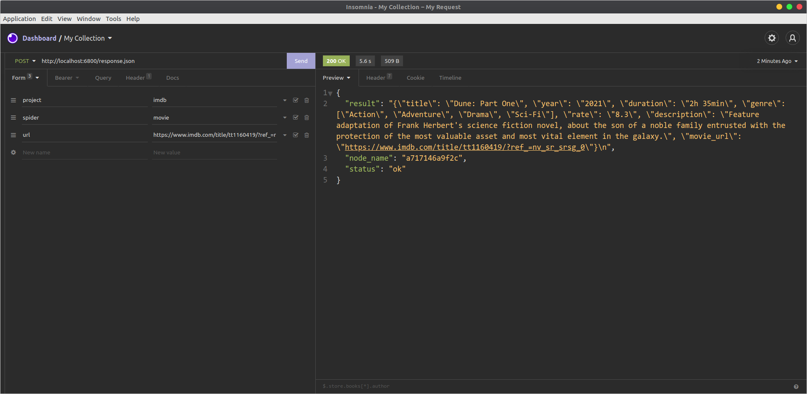

<p align="center">
  
</p>

<p align="center">
  <h1 align="center">IMDB Movies scrapy app </h1>
</p>

## in this project
- simple imdb movie scraper
- deployed scraper with scrapyd and scrapyd-client
- added new scraypd service to response with scraped data instead of scheduled it
- dockerized setup with python:3.9-alpine image

## Getting started

To build image, run:
```
sudo docker build -t 'scraper:last' .
```

To start container, run:
```
sudo docker run -d -p 6800:6800 --name scraper scraper:last
```

To start shell and access crawls, run:
```
sudo docker exec -it scraper bash
```

test crawler
```
scrapy crawl movie -a url="https://www.imdb.com/title/tt1160419"
```

to access crawl through api with instant response run from your shell or through api test client like insomia or postman
```
curl http://localhost:6800/response.json -d project=imdb -d spider=movie -d url="https://www.imdb.com/title/tt1160419"
```

<p align="center">
  
</p>
